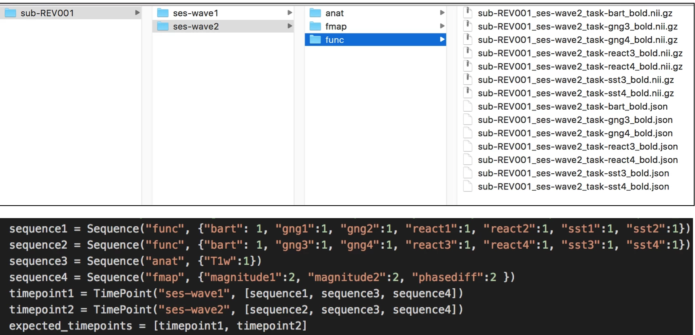

# Overview

These scripts will check whether each sequence has the correct number of runs within BIDS, based on a configuration file where the user specifies how many runs of each sequence are expected at each time point.

## Renaming rules

If there are **more** runs than expected, and the expected number of runs is greater than 1, the runs with the highest run numbers will be retained (up to X number of runs specified in the config file). Surplus runs will be moved to the `tmp_dcm2bids` folder. Retained runs will be renamed as runs 1-X with the lowest numbered run assigned the first number, and so on. If only one run is expected, the same operations just described will occur, but the remaining file will not have the run-number key-value portion of it's file name dropped.

If there are **fewer** runs than expected, a warning will be printed to the errorlog.

## Instructions
### The Configuration file

You will need to change some fields in the configuration file.  

- Change the paths
- Change the Sequence and TimePoint information
- Indicate whether files are gzipped or not zipped
- Indicate whether the tasks should be labeled by the order in which they were run
    - If so, indicate which files

Within the configuration file, you are asked to fill out a dictionary for each unique set of sequences and time points in your study. Within "Sequence", the first field entered identifies the sequence type for which you will be listing files. This should be consistent with the name of the folder in which the subsequent sequence files are housed. The next information entered is a series of key:value pairs in which the key is the part of the file name that makes it unique (e.g. task name for functional runs) and the value is the expected number of files with that key in the specified folder.

**Here's an example:**

In this example:

* The study has 2 time points, so we will make 2 "TimePoint" objects composed of the appropriate "Sequence" objects
* The two time points have different functional runs, so we'll make a "func" sequence for each time point
* Both time points have anatomical images with the same name, so we can create one "anat" sequence for anat and use it in both time points
* Both time points also have fieldmap images with the same name, so we can also create one "func" sequence to use at both time points
* Once we've constructed our "TimePoint" objects with the correct contents, we put them into the "expected\_timepoints" object, and we're done!




# Run the script
## On a Cluster

- Log into Talapas
```
    ssh -X username@Talapas-ln1.uoregon.edu
```
- `cd` to the directory that has your code in it
- Load the python3 module
```
    module load python3
```
- Run the `bidsQC.py` script

```
    python3 bidsQC.py
```
- Check your output and error logs

## Locally

- `cd` to the directory that has your code in it
- Run the `bidsQC.py` sciript
```
python3 bidsQC.py
```
- Check your output and error logs

# Check the BIDS Conversion

BIDS validator: [http://incf.github.io/bids-validator](http://incf.github.io/bids-validator/)