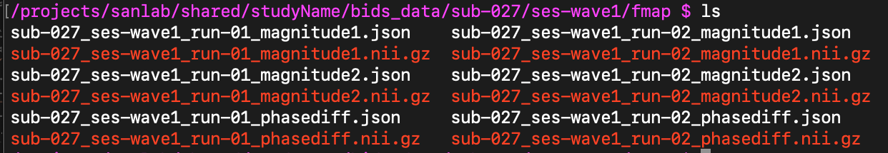
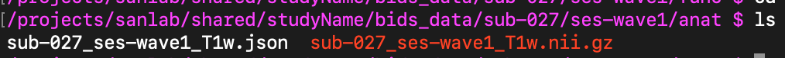
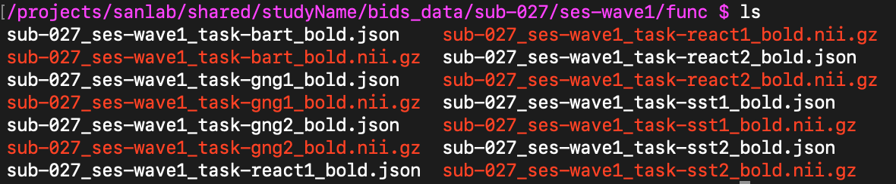
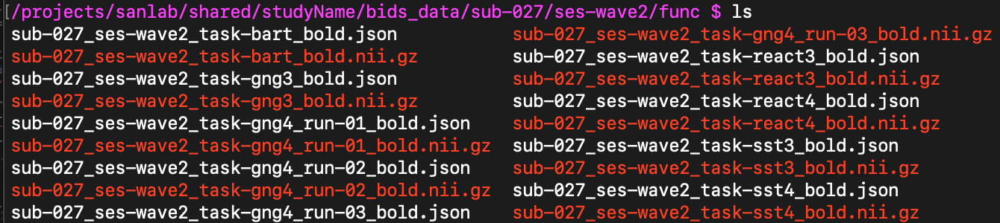
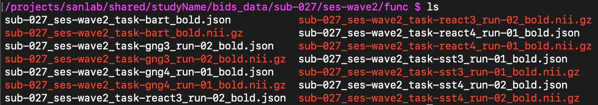
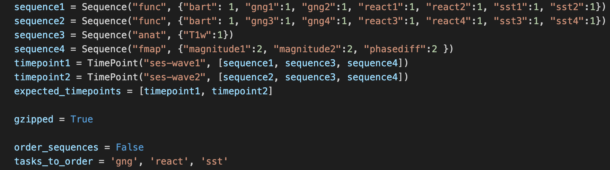

# Overview
1. [About qualityCheck](#about)
2. [Instructions for using the scripts](#instructions)
3. [Mock study example](#mock) with step-by-step examples

## Basic quality checking<a name="about">

These scripts will check whether each sequence has the correct number of runs within BIDS. The correct name and number of each sequence is specified in the configuration file for each timepoint. Results are output in log files.

**`qualityCheck.py` will run on all subjects in BIDS folder specified.** 

## Quality check and file rename

A second, optional feature is to reassign the run order, specified in the `task-#` portion of the file names. This can be useful if, for instance:  
- multiple copies of a task file exist as a result of having to start and stop a task in the scanner multiple times due to problems with the task script, user error, or participant variables.

**If using the renaming feature, it is suggested that you copy one participant's data to a test folder and try running these scripts there first.**  

It is important to note that **in the case of duplicates, the earlier runs are discarded, moved to the `tmp_dcm2bids` folder.** The script looks for X number of runs, based on what is indicated in the `Sequence` object, and retains the latest X number of runs for a given sequence. This is because the expectation is a sequence would not have been re-run if earlier iterations were problem free, and that the final iteration was the successful one. **If this is not behavior you want applied to your study, set `order_sequences = False`. You will need to either edit the `qualityCheck.py` script directly to create the desired behavior, or find a different way to correct your specific naming issues.** 

### Renaming rules

If there are **more** runs than expected, and the expected number of runs is greater than 1, the runs with the highest run numbers will be retained (up to X number of runs specified in the config file).   

Surplus runs are moved to the `tmp_dcm2bids` folder.  

Retained runs are renamed as runs 1-X with the lowest numbered run assigned the first number, and so on. If only one run is expected, the same operations just described will occur, but the remaining file will not have the `run-#` key-value portion of it's file name dropped.

If there are **fewer** runs than expected, a warning will be printed to the errorlog.  

See below for an example of the renaming function.

# Instructions<a name="instructions">

1. [Set-up `config_qualityCheck.py`](#config)
    1. [Change the paths](#paths)
    2. [Enter `Sequence` information](#sequence)
    3. [Enter `TimePoint` information](#timepoint)
    4. [Are files gzipped](#gzip)
    5. [Set `order_sequences`](#order)
2. [Run `qualityCheck`](#qc)
3. [Check logs](#checkLogs)
4. [Use the BIDS validator](#validator)

## Setting up the configuration file<a name="config">

You will need to change some fields in the file `config_qualityCheck.py`.  

### 1. Change the paths<a name="paths">

`path_bidsdata` is the path to the folder that houses your subject data.  
`logdir` is the path that sets where the logfiles are saved.  

### 2. Enter `Sequence` information<a name="sequence">

Within the configuration file, you are asked to fill out a dictionary for each unique set of sequences and time points in your study. 
 
A `Sequence` object is composed of one folder name and an unspecified number of sequence names.  

Within the `Sequence` object, the first field entered is the name of the folder that contains the files. As the data are in BIDS, it also identifies the sequence type. For example, `func` for functional sequences or `anat` for anatomical sequences.
 
The `key:value pairs` within the curly `{} `braces are `taskName:numberOfRuns`. E.g. a task named stopsignal that the subject completed twice would be entered as `{'stopsignal':2}`. If there are multiple sequences within a `Sequence` object, they are comma seperated.  

Create as many `Sequence` objects as you need. Then, assign them to the proper timepoint (see next step).  

#### Example
A completed `Sequence` object would look something like this:  

`sequence1 = Sequence('func', {'stopsignal': 2, 'react':1})`

This indicates a functional sequence named stopsignal was completed twice and a functional task named react was completed once.  

### 3. Enter `TimePoint` information<a name="timepoint">

#### timepoint#

A `TimePoint` object consists of one folder name, indicating what session the data were collected in, and an unspecified number of `Sequence`s.  

Every study will have at least one timepoint.  

Within the `Sequence` object, the first field entered is the name of the folder that contains the files. As the data are in BIDS, it should follow the format `ses-wave#`.  

Within the square `[]` brackets, list the sequences that should exist for that timepoint. A sequence can be used in more than one timepoint.  

#### expected_timepoints
List all timepoints that should exist for your participants.

e.g. `expected_timepoints = [timepoint1, timepoint2]`  

#### Example

A study with two timepoints. The timepoints had different functional runs, the names of which which were entered into `sequence1` and `sequence2`, respectively. Both timepoints had the same anatomical scan `sequence3` and the same fieldmaps `sequence4`:

```
timepoint1 = TimePoint("ses-wave1", [sequence1, sequence3, sequence4])
timepoint2 = TimePoint("ses-wave2", [sequence2, sequence3, sequence4])
```

### 4. Indicate whether files are gzipped or not zipped<a name="gzip">

`gzipped = True` will look for the file extension `.nii.gz`  
`gzipped = False` will look for the file extension `.nii`  

### 5. Set `order_sequences`<a name="order">

Indicate whether the tasks should be labeled by the order in which they were run by setting the `order_sequences` variable to `True` or `False`.  

- If `False`, no file names will be changed. The script will simply count the number of runs for each sequence, compare against the expected number, and output the results to the log file.
- If `True`
    - Assign the sequence names you want renamed to the `tasks_to_order` variable.  
    e.g. `tasks_to_order = 'gng', 'react', 'sst'`
    - Excess runs will be moved to the `tmp_dcm2bids` folder. The highest numbered runs for a given sequence are retained. The retained runs are given new run numbers (`run-#`) based on the order in which they were collected in the scanner, with the renaming starting at `run-1`.

## Run the script<a name="qc">

In the `bidsQC/qualityCheck` folder, run the file `qualityCheck.py` with the command `python3 qualityCheck.py`.  

If you're on a cluster, you may have to `module load python3` first.

## Check output and error logs<a name="checkLogs">

They indicate wherther a participant has all expected sequences and timepoints based on what the contents of `config_qualityCheck.py`.  

## Check the BIDS Conversion<a name="validator">

BIDS validator: [http://incf.github.io/bids-validator](http://incf.github.io/bids-validator/)

Instructions for using the validator on Talapas are [here](https://github.com/kdestasio/bidsQC/blob/main/uoTutorial.md#bids-validator-on-talapas).


If you need to add fieldmap information to the .json sidecar files, see the `bidsQC/conversion` folder README for instructions on using `fmap_intendedfor.py` either [locally](https://github.com/kdestasio/bidsQC/blob/main/conversion/runConversionLocally.md#7-fmap_intendedforpy) or on a [cluster](https://github.com/kdestasio/bidsQC/blob/main/conversion/runConversionOnCluster.md#7-fmap_intendedforpy).  
    
## Mock study example<a name="mock">

### Study details

Sequences with a `*` are functional runs that, while the same task, were counterbalanced and contained different images. We need to be able to differentiate them, but they are considered the same sequence for the purposes of appending the task `run-#`.  

- There are two timepoints  
    - Timepoint 1 should contain:
        - 2 fieldmaps
        
        - 1 anatomical sequence
        
        - 4 functional tasks
        
            - bart
            - *gng1 & gng2
            - *react1 & react2
            - *sst1 & sst2
            
    - Timepoint 2 should contain:
        - 2 fieldmaps
        - 1 anatomical sequence
        - 4 functional tasks
            - bart
            - *gng3 & gng4
            - *react3 & react4
            - *sst3 & sst4


### Creating the Sequence objects

- The two time points have different functional runs, so we'll make a `func` sequence for each time point
- Both time points have anatomical images with the same name, so we can create one `anat` sequence and use it in both time points
- Both time points also have the same fieldmap images with the same name, so we can also create one `fmap` sequence to use at both time points

```
sequence1 = Sequence("func", {"bart": 1, "gng1":1, "gng2":1, "react1":1, "react2":1, "sst1":1, "sst2":1})
sequence2 = Sequence("func", {"bart": 1, "gng3":1, "gng4":1, "react3":1, "react4":1, "sst3":1, "sst4":1})
sequence3 = Sequence("anat", {"T1w":1})
sequence4 = Sequence("fmap", {"magnitude1":2, "magnitude2":2, "phasediff":2 })
```

### Creating the TimePoint objects

- The study has 2 time points, so we make 2 `TimePoint` objects composed of the appropriate `Sequence` objects

```
timepoint1 = TimePoint("ses-wave1", [sequence1, sequence3, sequence4])
timepoint2 = TimePoint("ses-wave2", [sequence2, sequence3, sequence4])
expected_timepoints = [timepoint1, timepoint2]
```

- Once we've constructed our `TimePoint` objects with the correct contents, we put them into the `expected_timepoints` object.

```
expected_timepoints = [timepoint1, timepoint2]
```


### Setting script variables

#### Our files are gzipped. 

`gzipped = True`

### order_sequences = True
If we did not need to append the `run-#` tag, and/or if we did not have duplicate runs from difficulty during scanning, we would set `order_sequences = False`, run the script, and simply check the log files to check which participants were missing sequences and/or timepoints.  

We do want to append the `run-#` tag to our functional files. Because our functional runs were named so as to indicate their version (e.g `gng1` vs. `gng2`), they were not recognized as multiple runs of the same task during the initial `dcm2bids` conversion.  

We also want the sequences re-numbered because have multiples of some functional sequences due to issues during scanning.  

Here's what we have:  


And here's what we want:  


By entering the task names into `tasks_to_order` without the counterbalance tag (e.g. `gng` rather than `gng1`), we can instruct the script to consider them iterations of the same task and append the appropriate `run-#` according to the order in which they were collected.  

```
order_sequences = False
tasks_to_order = 'gng', 'react', 'sst'
```
### An important note about renaming
It is important to note that **in the case of duplicates, the earlier runs are discarded, moved to the `tmp_dcm2bids` folder.** The script looks for X number of runs, based on what is indicated in the `Sequence` object, and retains the last X number of runs for a given sequence. This is because the expectation is a sequence would not have been re-run if earlier iterations were problem free, and that the final iteration was the successful one. **If this is not behavior you want applied to your study, set `order_sequences = False`. You will need to either edit the `qualityCheck.py` script directly to create the desired behavior, or find a different way to correct your specific naming issues.** 

### Here's what our completed config file looks like 



Once we run the script, our files are properly named and the undesired runs are placed in the `tmp_dcm2bids` folder. An account of the actions performed, along with information on missing sequences and/or timepoints is stored in the log file.  
