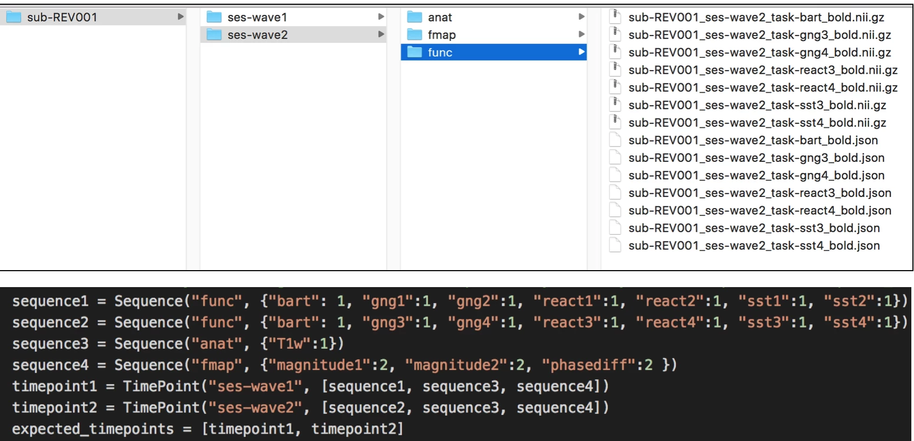

# Overview

These scripts will check whether each sequence has the correct number of runs within BIDS. The correct name and number of each sequence is specified in the configuration file for each timepoint. Results are output in log files.

**`qualityCheck.py` will run on all subjects in BIDS folder specified."** If using the renaming feature, it is suggested that you copy one participant's data to a test folder and try running these scripts there first.

A second, optional feature is to reassign the run order, specified in the `task-#` portion of the file names. This can be useful if, for instance:  
- multiple copies of a task file exist as a result of having to start and stop a task in the scanner multiple times due to problems with the task script, user error, or participant variables.

## Renaming rules

If there are **more** runs than expected, and the expected number of runs is greater than 1, the runs with the highest run numbers will be retained (up to X number of runs specified in the config file).   

Surplus runs are moved to the `tmp_dcm2bids` folder.  

Retained runs are renamed as runs 1-X with the lowest numbered run assigned the first number, and so on. If only one run is expected, the same operations just described will occur, but the remaining file will not have the `run-#` key-value portion of it's file name dropped.

If there are **fewer** runs than expected, a warning will be printed to the errorlog.  

See below for an example of the renaming function.

## Instructions

### The Configuration file

You will need to change some fields in the configuration file.  

#### 1. Change the paths

`pathToBidsFolder` is the path to the folder that houses your subject data.  
`logdir` is the path that sets where the logfiles are saved.  

#### 2. Enter `Sequence` information

Within the configuration file, you are asked to fill out a dictionary for each unique set of sequences and time points in your study. 

#### 3.  Building sequences
 
A `Sequence` object is composed of one folder name and an unspecified number of sequence names.  

Within the `Sequence` object, the first field entered is the name of the folder that contains the files. As the data are in BIDS, it also identifies the sequence type. For example, `func` for functional sequences or `anat` for anatomical sequences.
 
The `key:value pairs` within the curly `{} `braces are `taskName:numberOfRuns`. E.g. a task named stopsignal that the subject completed twice would be entered as `{'stopsignal':2}`. If there are multiple sequences within a `Sequence` object, they are comma seperated.  

Create as many `Sequence` objects as you need. Then, assign them to the proper timepoint (see next step).  

##### Example
A completed `Sequence` object would looks something like this:  

`sequence1 = Sequence('func', {'stopsignal': 2, 'react':1})`

This indicates a functional sequence named stopsignal was completed twice and a functional task named react was completed once.  

#### 4. Enter `TimePoint` information

##### timepoint#

A `TimePoint` object consists of one folder name, indicating what session the data were collected in, and an unspecified number of `Sequence`s.  

Every study will have at least one timepoint.  

Within the `Sequence` object, the first field entered is the name of the folder that contains the files. As the data are in BIDS, it should follow the format `ses-wave#`.  

Within the square `[]` brackets, list the sequences that should exist for that timepoint. A sequence can be used in more than one timepoint.  

##### expected_timepoints
List all timepoints that should exist for your participants.

e.g. `expected_timepoints = [timepoint1, timepoint2]`  

##### Example

A study with two timepoints. The timepoints had different functional runs, the names of which which were entered into `sequence1` and `sequence2`, respectively. Both timepoints had the same anatomical scan `sequence3` and the same fieldmaps `sequence4`:

```
timepoint1 = TimePoint("ses-wave1", [sequence1, sequence3, sequence4])
timepoint2 = TimePoint("ses-wave2", [sequence2, sequence3, sequence4])
```

#### 5. Indicate whether files are gzipped or not zipped

`gzipped = True` will look for the file extension `.nii.gz`  
`gzipped = False` will look for the file extension `.nii`  

#### 6. Set `order_sequences`

Indicate whether the tasks should be labeled by the order in which they were run by setting the `order_sequences` variable to `True` or `False`.  

- If `False`, no file names will be changed. The script will simply count the number of runs for each sequence, compare against the expected number, and output the results to the log file.
- If `True`
    - Assign the sequence names you want renamed to the `tasks_to_order` variable.  
    e.g. `tasks_to_order = 'gng', 'react', 'sst'`
    - Excess runs will be moved to the `tmp_dcm2bids` folder. The highest numbered runs for a given sequence are retained. The retained runs are given new run numbers (`run-#`) based on the order in which they were collected in the scanner, with the renaming starting at `run-1`.

**Here's an example:**

In this example:

- The study has 2 time points, so we will make 2 "TimePoint" objects composed of the appropriate "Sequence" objects
- The two time points have different functional runs, so we'll make a "func" sequence for each time point
- Both time points have anatomical images with the same name, so we can create one "anat" sequence for anat and use it in both time points
- Both time points also have fieldmap images with the same name, so we can also create one "func" sequence to use at both time points
- Once we've constructed our "TimePoint" objects with the correct contents, we put them into the "expected\_timepoints" object, and we're done!



## Run the script

### On a Cluster

- Log into Talapas
```
    ssh -X username@Talapas-ln1.uoregon.edu
```
- `cd` to the directory that has your code in it
- Load the python3 module
```
    module load python3
```
- Run the `qualityCheck.py` script

```
    python3 qualityCheck.py
```
- Check your output and error logs

## Locally

- `cd` to the directory that has your code in it
- Run the `qualityCheck.py` sciript
```
python3 qualityCheck.py
```
- Check your output and error logs

# Check the BIDS Conversion

BIDS validator: [http://incf.github.io/bids-validator](http://incf.github.io/bids-validator/)