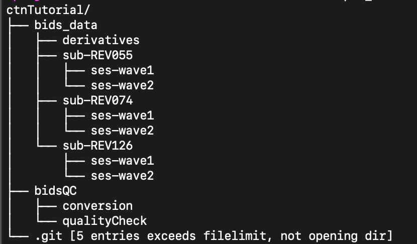

# bidsQC Tutorial: University of Oregon

This page provides detailed steps specific for running bidsQC on the University of Oregon high performance cluster, Talapas.  
## Table of contents

- [Setup](#setup)
  - [1. Get a high performance cluster account](#talapas-account)
  - [2. Get a GitHub account](#github-account)
  - [3. Create dcm2bids singularity image](#dcm2bids-image)
  - [4. Create BIDS validator singularity image](#validator-image)
  - [5. Set up your study repository](#pull-bidsqc)
  - [6. Accessing CTN BIDS Workshop data](#get-data)
- [Convert dicoms to niftis](#dcm-nii)
- [Create metadata files](#metadata)
  - [dataset-desctription.json](#dataset-description)
  - [README](#readme)
- [Use the BIDS validator](#bids-validator)
  - [Create a .bidsignore file](#bidsignore)
  - [Validate the dataset](#validate)

## Setup<a name="setup">
### 1. Request an account on the UO high performance cluster (Talapas)<a name="talapas-account">

If you do not already have one, request an account on Talapas. If you do have an account, make sure you know how to log on. See [the Talapas wiki](https://hpcrcf.atlassian.net/wiki/spaces/TCP/pages/7312376/Quick+Start+Guide) for account creation and login instructions.  

### 2. Create a github account<a name="github-account">

[Create a github account](https://github.com/) if you don't already have one.
    
### 3. Get the dcm2bids tools as a singularity image<a name="dcm2bids-image">

You will need a singularity image of the dcm2bids tools on Talapas. To do so, create a singularity image using the following steps:  

1. `cd` into the directory where you would like to store the image. One suggestion is to create a folder called `containers` within your group's shared folder and store all singularity images together. For example:
    ```
    mkdir /projects/sanlab/shared/containers
    cd /projects/sanlab/shared/containers
    ```
2. Then create the image with the following command, changing the date in the image name to today's.  
    
    ```
    module load singularity
    singularity pull dcm2bids_2021-12-30.sif docker://unfmontreal/dcm2bids:latest
    ```

### 4. Get the BIDS validator tools as a singularity image<a name="validator-image">

We will create a singularity image of the [BIDS-validator tool](https://github.com/bids-standard/bids-validator) to use on Talapas. Once the image is created, we can submitted instructions via the command line to validate out dataset.

1. `cd` into the directory where you would like to store your singularity image.  
2.  Then create the image with the following command, changing the date in the image name to today's.  

```
singularity pull bids-validator_2021-12-28.sif docker://bids/validator
```

### 5. Set-up your study repository<a name="pull-bidsqc">

We will use version control to track changes to your bidsQC files AND other scripts, files, etc. that you are using for your analyses
  
You may need to generate a personal access token if you haven't yet done so. This is what you use when asked for a password when pushing a repo. To generate a token, click your User icon in the top right of the github page. Then select **Settings > Developer settings > Personal access tokens > Generate new token**. See the [github documentation](https://docs.github.com/en/authentication/keeping-your-account-and-data-secure/creating-a-personal-access-token) on setting the token scope. Be sure to save the token somewhere secure where you can look it up later, like a password manager, or you will have to recreate it.

***NOTE:** When using version control at the level of the `studyName` folder, you will want to immediately familiarize yourself with the `.gitignore` file to ensure you are not commiting any participant data or other sensitive information to your repository. The likelihood is that you will need to use a `.gitignore` file regardless, but it's essential if you will have participant data in your folder.

This structure acan be useful if you want to track changes for other scripts, files, etc. that you are using for your analyses. The resulting folder structure will look something like the following, with ctnTutorial being the name of your study folder. Note the location of the `.git` directory.  


  
For the purposes of this tutorial, we will also be using scripts from the [ctnTutorial repo on GitHub](https://github.com/kdestasio/ctnTutorial). This repository contains scripts that have been customized to work with the CTN BIDS Workshop data. While participants are encouraged to attempt tailoring the bidsQC scripts to the data themselves during the workshop, it will be useful to have the completed examples for comparison. The only components of the scripts in the ctnTutorial repo that will need to be changed by users are the paths in the configuration files.  
  
##### Steps
  
1. `cd` into the directory where you would like to store the bidsQC scripts (usually a study specific directory)  
    e.g. `cd /projects/sanlab/shared/studyName`  
2. [git clone](https://docs.github.com/en/repositories/creating-and-managing-repositories/cloning-a-repository) the bidsQC repository into your folder  
    ```
    git clone https://github.com/kdestasio/bidsQC.git
    ```
3. Ensuring you are in yout study directory, clone the ctnTutorial repository
    ```
    git clone https://github.com/kdestasio/ctnTutorial.git
    ```  
4.  `cd` into the `bidsQC` directory and remove the `.git` directory and the `.gitignore` file. From the study directory:  
    ```
    cd bidsQC; rm -rf .git .gitignore
    ```
5.  `cd` into the `ctnTutorial` directory and remove the `.git` directory. From the study directory:  
    ```
    cd bidsQC; rm -rf .git .gitignore
    ```
6. Create a new `.gitignore` file in your study directory. Let's initialize it to ignore the folder that will contain our bids data, as well as our pycache and our logs directories.  
    ```
    cat > .gitignore
    ```
    Then press enter. Now your cursor should be on the next line. Type the following on two seperate lines.
    ```
    bids_data/
    log*/
    __pycache__/
    ```
    Press `Ctrl+D` when finished.

7. Initiate a new repository one level up in your `studyName` directory.
    - On github, go to the "Repositories" tab. Click the green button "New" in the upper right-hand corner to create a new repository.
    - Name the repository EXACTLY what your study folder is named (e.g. if your folder is called Study-name, your repo must also be named Study-name)
    - Do NOT initialize the repository with a README, .gitignore, or license.
    - Click "Create repository"
    - At the command line, make sure you are in your study directory. If you are not `cd` into it. 
    - Follow the GitHub instructions to "create a new repository on the command line" by copy and pasting each command into your terminal.
      - Note that when prompted for your password the first time you attempt to push your new repository, what is needed is your [personal access token)[#pull-bidsqc].  
8. Add, commit, and push the .gitignore file, ctnTutorial directory, and the bidsQC directory using the following commands.
    ```
    git add .gitignore bidsQC/ ctnTutorial/
    git commit -m "Add bidsQC directory. Contents from https://github.com/kdestasio/bidsQC.git and https://github.com/kdestasio/ctnTutorial.git"
    git push
    ```

Your study directory should now look like this:
```
studyName/
├── bidsQC
│   ├── conversion
│   └── qualityCheck
├── ctnTutorial
│   └── bidsQC
│       ├── conversion
│       └── qualityCheck
├── .gitignore
└── .git 
```
  
### 6. Accessing CTN BIDS Workshop data<a name="get-data">

There are sample DICOMS available on Talapas. The path is:  
`/projects/sanlab/shared/REV_examples`

## DICOM to Nifti conversion<a name="dcm-nii">

We will use a singularity image of the dcm2bids tools to convert the data from dicom files to nifti files. See the steps at the [top of this page](#dcm2bids-image) to create the singularity image if you have not done so already.  

To convert the data, follow the instructions in the [`bidsQC/conversion/README.md`](/conversion/README.md#running-the-scripts-on-a-linux-cluster). Within the README, follow the appropriate link for conversion on a local machine or high performance cluster.  

## Create metadata files<a name="metadata">

Adherence to the BIDS standard requires certain metadata files exist within the top level of the dataset. 

### dataset_description.json<a name="dataset-description">

This [dataset_description.json](https://bids-specification.readthedocs.io/en/stable/03-modality-agnostic-files.html#dataset_descriptionjson) **must** exist. See the official BIDS specification for an example.  

### README<a name="readme">

The [README](https://bids-specification.readthedocs.io/en/stable/03-modality-agnostic-files.html#readme) file must be in either ASCII or UTF-8 encoding and should not have a file extension.

## BIDS Validator on Talapas<a name="bids-validator">

We will use a singularity image of the BIDS validator to verify the data are BIDS compliant. See the steps at the [top of this page](#validator-image) to create the singularity image if you have not done so already.    

### .bidsignore<a name="bidsignore">

The [.bidsignore](https://www.npmjs.com/package/bids-validator#bidsignore) file should be created within the top level of our dataset. This file indicates directories and files to be ignored by the BIDS validator. Inclusion of this file streamlines the validator output and makes it easier to identify real issues with dataset adherence to BIDS.  

### Run validation<a name="validate">

From within the directory that contains the bids-validator singularity image, run the following command from the command line.  

First change the paths so they point to your data and change the bids-validator image name to match the name you gave yours in the step above.  

```
singularity exec -B /projects/sanlab/shared/ctnTutorial/bids_data:/projects/sanlab/shared/ctnTutorial/bids_data:ro bids-validator_2021-12-28.sif \bids-validator /projects/sanlab/shared/ctnTutorial/bids_data
```

The validation results will be output in your terminal window. Make any necessary changes and repeat the validation process if necesary.  
